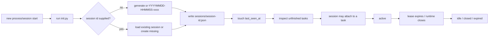
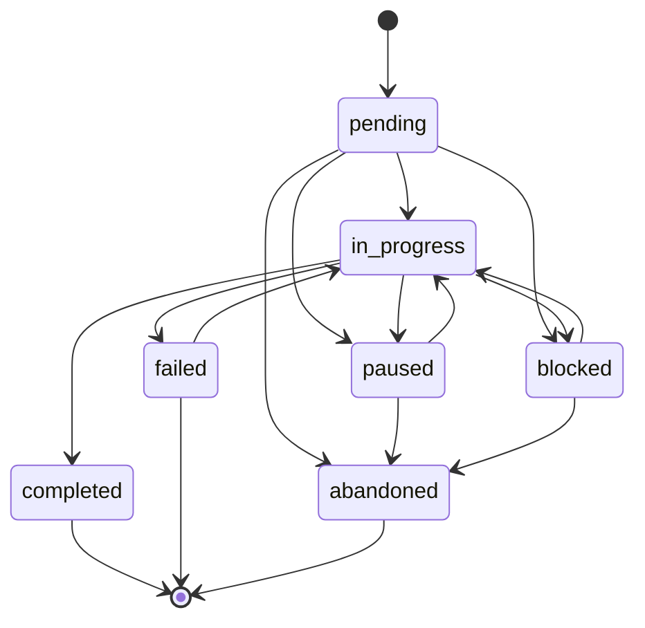
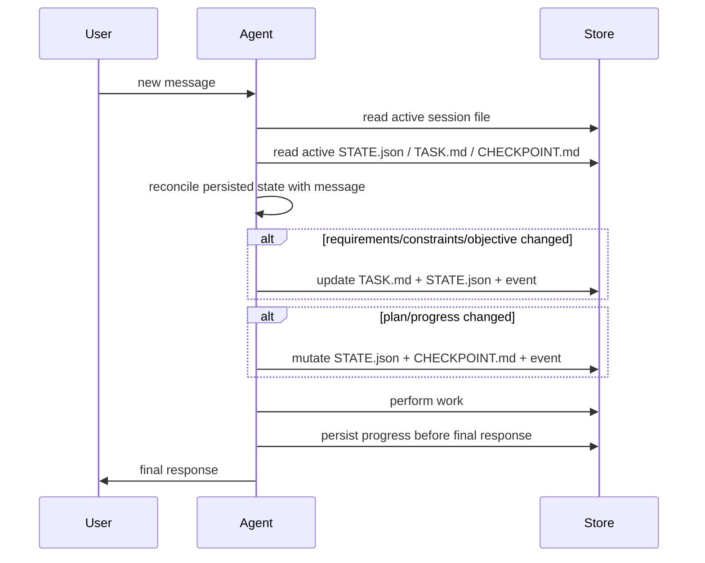
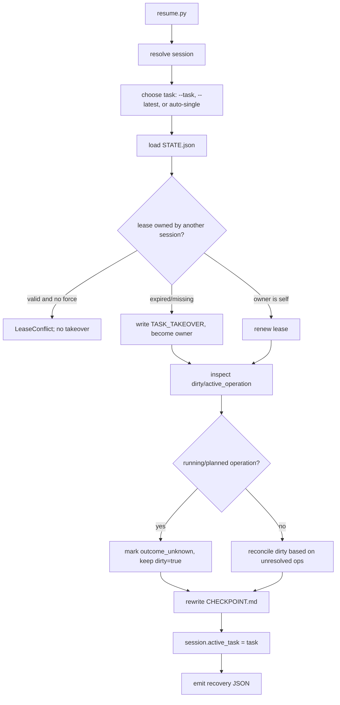
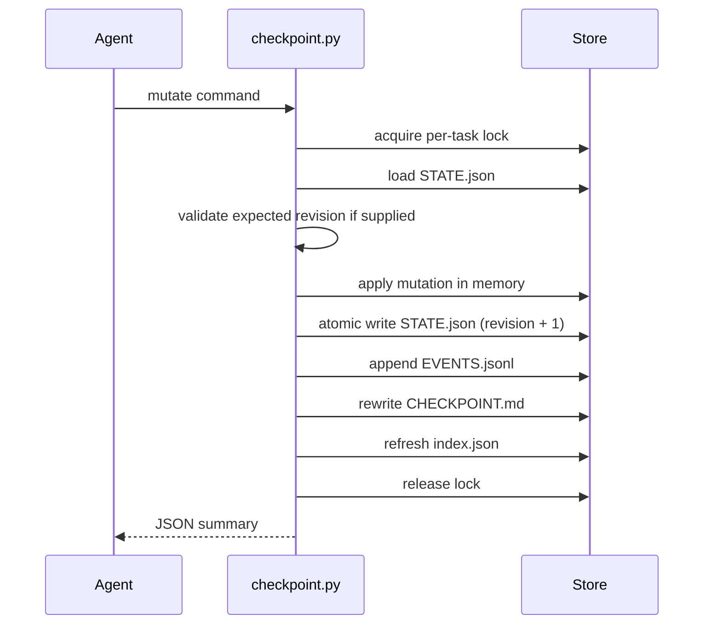
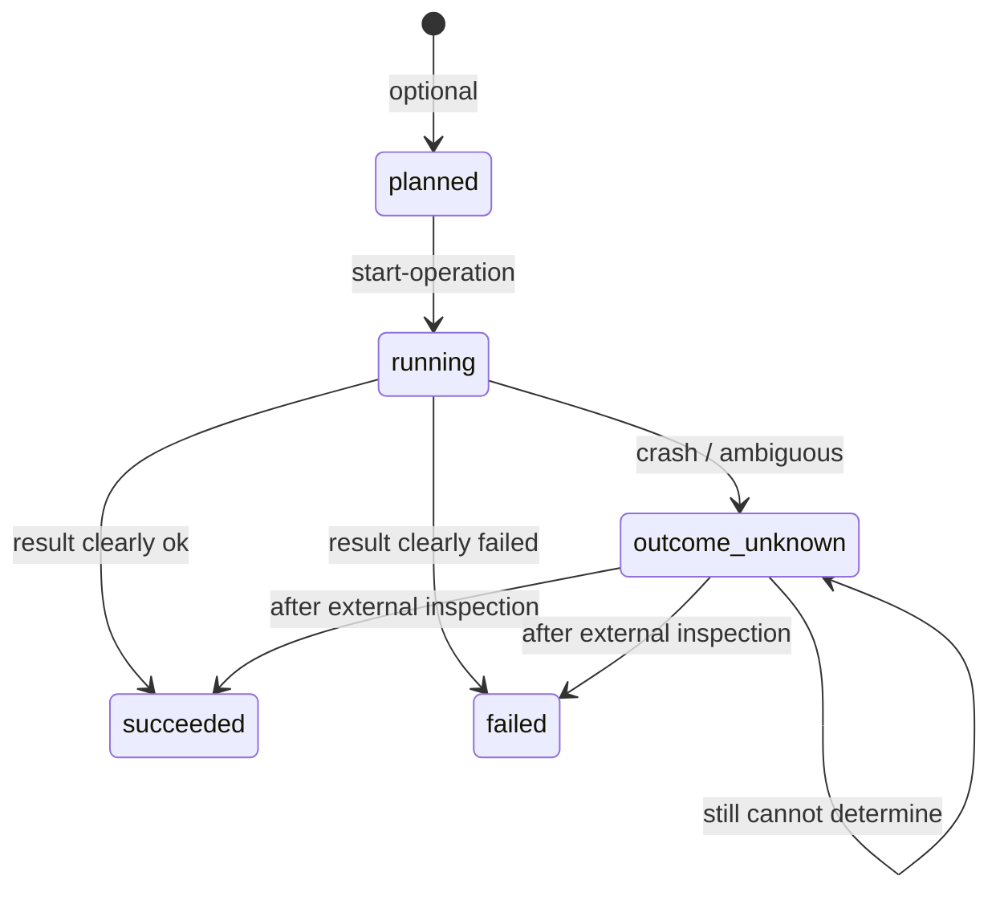
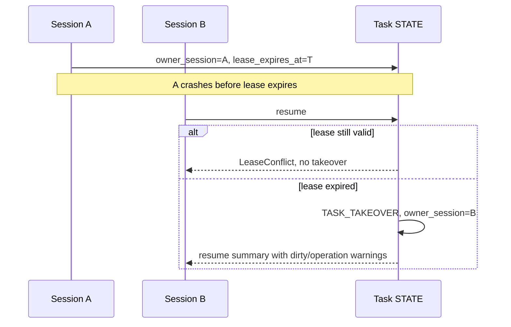
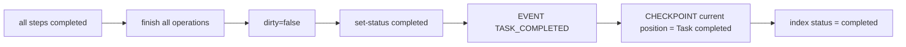

# Session Reliability Protocol

This document defines the V1 lifecycle rules implemented by `session-reliability`.

## Contents

- [1. Entity relationship](#1-entity-relationship)
- [2. Workspace and store resolution](#2-workspace-and-store-resolution)
- [3. Session lifecycle](#3-session-lifecycle)
- [4. Task lifecycle](#4-task-lifecycle)
- [5. User turn lifecycle](#5-user-turn-lifecycle)
- [6. Session start and task selection](#6-session-start-and-task-selection)
- [7. Resume lifecycle](#7-resume-lifecycle)
- [8. Checkpoint lifecycle](#8-checkpoint-lifecycle)
- [9. Side-effect lifecycle](#9-side-effect-lifecycle)
- [10. Takeover lifecycle](#10-takeover-lifecycle)
- [11. Completion lifecycle](#11-completion-lifecycle)
- [12. Event log](#12-event-log)

## 1. Entity relationship

```text
Session (sessions/<session-id>.json)
   |
   +-- active_task (nullable)
             |
             v
Task (tasks/<task-id>/)
   +-- TASK.md          durable definition
   +-- STATE.json       authoritative current state
   +-- CHECKPOINT.md    compact recovery summary
   +-- EVENTS.jsonl     append-only audit/recovery log
          +-- Steps
          +-- Operations
          +-- Facts / Decisions / Blockers
```

Session IDs and task IDs are separate.  `native_session_id` is optional
metadata and must not be required by any logic.

## 2. Workspace and store resolution

```text
resolve workspace root:
  1. CLI --workspace
  2. SESSION_RELIABILITY_WORKSPACE
  3. cwd

resolve store:
  1. SESSION_RELIABILITY_STORE
  2. <workspace-root>/.agents/store/session-reliability/
```

`init.py` creates the store, index, `sessions/`, `tasks/`, and `archive/` when
needed.

If `--session-id` is supplied, that exact reliability session is used.  If it
is omitted but `--native-session-id` is supplied, initialization reuses the
unique existing reliability session with that native id.  Zero matches creates
a new `sr-*` session; multiple matches fail safely with
`session_identity_conflict` instead of selecting randomly.

Keep the returned reliability `session_id` for the lifetime of the current
conversation and pass it to subsequent task mutations.  Do not generate a new
`sr-*` session for every user turn.

## 3. Session lifecycle



Commands:

See `references/cli.md` for exact command syntax.

`init.py` never randomly binds a task when multiple unfinished tasks exist.

## 4. Task lifecycle



Allowed statuses:

```text
pending
in_progress
blocked
paused
completed
failed
abandoned
```

Task creation:

See `references/cli.md` for exact command syntax.

Ordinary task mutations:

- Require `session_id == owner_session` while the lease is valid.
- Are rejected with `lease_conflict` if the caller omits `--session-id`, uses a
  foreign session id, or attempts to mutate an unowned task.
- Never change `owner_session`.
- Automatically renew the owner's lease using `lease_duration_seconds`
  (fallback 900) and refresh the session heartbeat on success.

An unowned task must be bound through `attach-session` or `resume` before any
ordinary mutation.  A foreign session with an expired/missing lease must use
the same explicit flows rather than mutating directly.

Completion:

See `references/cli.md` for exact command syntax.

Completion is refused while `dirty=true` or unresolved operations exist.

## 5. User turn lifecycle



Commands used during a turn:

See `references/cli.md` for exact command syntax.

## 6. Session start and task selection

```text
run init.py
  |
  +-- session.active_task exists?
  |       -> resume that task
  |
  +-- exactly one resumable task?
  |       -> resume it
  |
  +-- multiple resumable tasks?
  |       -> present candidates; do not auto-bind
  |
  +-- user explicitly names a task?
  |       -> use it
  |
  +-- user starts a new task?
          -> create new task
```

`init.py` output shape:

```json
{
  "session_id": "sr-20260930-223501-a7f3",
  "native_session_id": null,
  "session_file": "...",
  "session_created": true,
  "active_task": null,
  "resumable_tasks": []
}
```

## 7. Resume lifecycle



Resume command:

See `references/cli.md` for exact command syntax.

Resume JSON includes at least:

```json
{
  "task_id": "task-x",
  "status": "in_progress",
  "current_step": "step-2",
  "next_actions": ["..."],
  "dirty": false,
  "checkpoint_path": "...",
  "task_path": "...",
  "task_md_path": "...",
  "state_path": "..."
}
```

The CLI also includes `task_md` and `checkpoint_md` content so a fresh Agent
can read a compact summary without a second call.

## 8. Checkpoint lifecycle



`STATE.json` is updated on every durable mutation.  `CHECKPOINT.md` is
re-rendered after every mutation so it cannot lag behind the response.

## 9. Side-effect lifecycle

An operation is recorded only for actions that change state outside the
conversation and are not safely repeatable — non-idempotent scripts, publishes,
sends, installs, deletions, remote mutations, service start/stop.  Ordinary
file edits are step work and stay out of the ledger, so the bookkeeping does
not outgrow the work it protects.

The point of the ledger is the crash case: a persisted `running` operation is
the only evidence that an action may already have taken effect, and it is what
lets a later session inspect before retrying instead of duplicating a
non-idempotent effect.



Before a side-effect tool call:

```text
start-operation
-> operation.state = running
-> dirty = true
-> atomic save
-> execute real tool
```

After the tool call:

```text
clear success   -> finish-operation --outcome succeeded
clear failure   -> finish-operation --outcome failed
ambiguous/crash -> finish-operation --outcome outcome_unknown
```

Resume conservatively changes `running` to `outcome_unknown`; it never changes
it to `succeeded`.

## 10. Takeover lifecycle



Forced takeover is available only as an explicit override.  It is appropriate
when the user explicitly says the previous session failed, became unavailable,
or cannot continue, even if the previous lease is still valid.  It writes
`TASK_TAKEOVER` with `forced=true` and must be followed by dirty/uncertain
operation reconciliation.

Task takeover transfers ownership of the task only.  It does not invalidate the
previous reliability session and does not clear that session's unrelated
`active_task`.  If the previous session's `active_task` equals the taken-over
task, only that binding is cleared.  `tasks/<id>/STATE.json` is authoritative
for ownership; session metadata is convenience binding data.

See `references/cli.md` for exact command syntax.

## 11. Completion lifecycle



Task data is never automatically deleted.  Archiving is reserved for V1:

```text
tasks/<task-id>/ -> archive/<task-id>/
```

## 12. Event log

`EVENTS.jsonl` is append-only, one JSON object per line.  The implementation
supports at least:

```text
SESSION_CREATED
SESSION_ATTACHED
TASK_CREATED
TASK_ATTACHED
TASK_DETACHED
STEP_STARTED
STEP_COMPLETED
STEP_FAILED
FINDING_RECORDED
DECISION_RECORDED
OPERATION_STARTED
OPERATION_SUCCEEDED
OPERATION_FAILED
OPERATION_OUTCOME_UNKNOWN
CHECKPOINT_CREATED
TASK_PAUSED
TASK_BLOCKED
TASK_COMPLETED
TASK_FAILED
TASK_ABANDONED
TASK_TAKEOVER
```

Additional implementation event types include `STEP_ADDED`, `STEP_BLOCKED`,
`BLOCKER_ADDED`, `BLOCKER_RESOLVED`, `NEXT_ACTIONS_SET`,
`CURRENT_STEP_CHANGED`, `TASK_STATUS_CHANGED`, `REQUIREMENTS_UPDATED`,
`LEASE_RENEWED`, and `STATE_CORRUPTION_DETECTED`.

Events are for audit, dirty recovery, state-corruption assistance, and
understanding what a previous Agent did.  A normal resume does not read the
entire event log.
