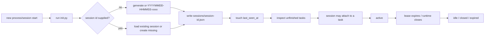
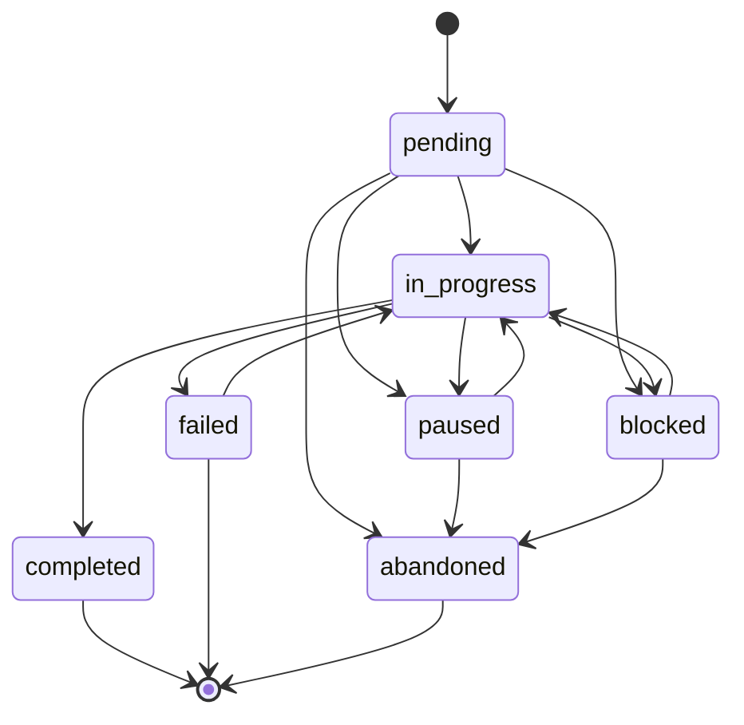
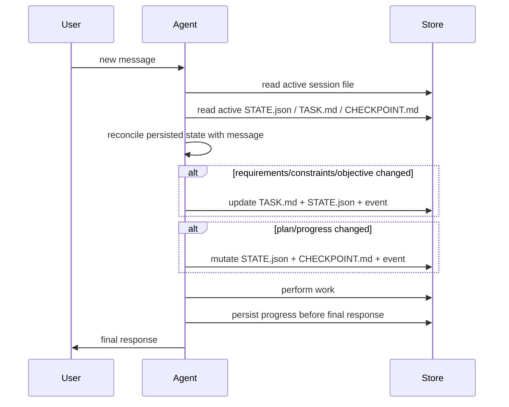
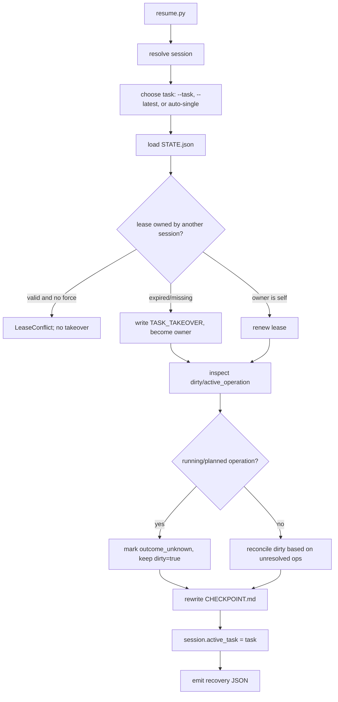
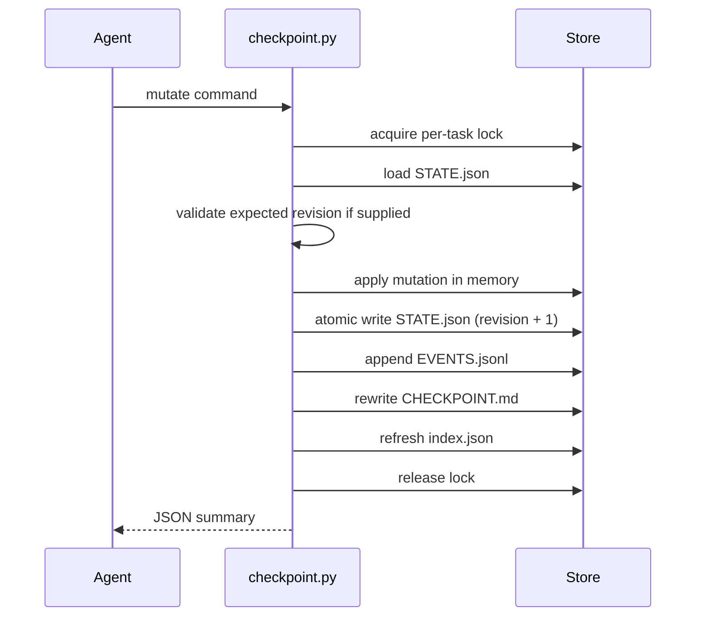
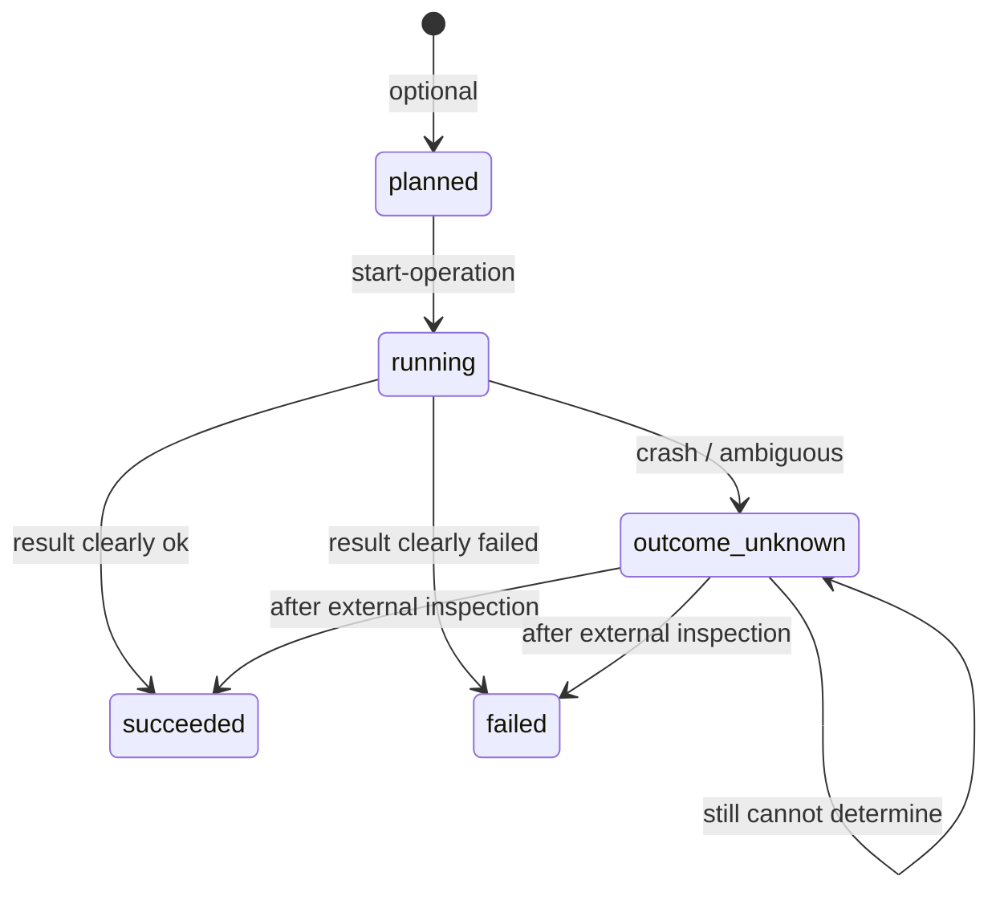
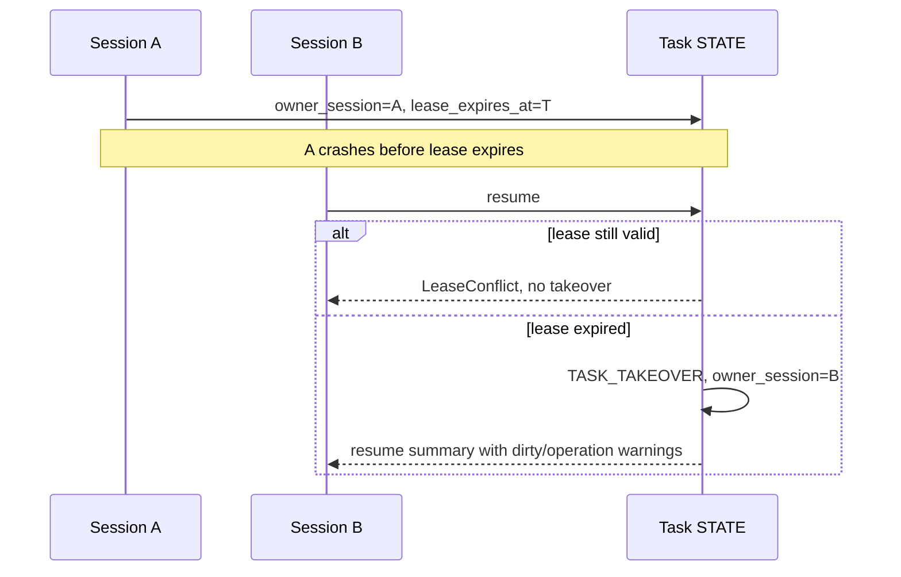
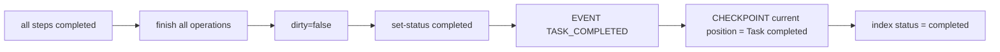

# Session Reliability Protocol

This document defines the V1 lifecycle rules implemented by `session-reliability`.

## 1. Entity relationship

```text
Session (sessions/<session-id>.json)
   |
   +-- active_task (nullable)
             |
             v
Task (tasks/<task-id>/)
   +-- TASK.md          durable definition
   +-- STATE.json       authoritative current state
   +-- CHECKPOINT.md    compact recovery summary
   +-- EVENTS.jsonl     append-only audit/recovery log
          +-- Steps
          +-- Operations
          +-- Facts / Decisions / Blockers
```

Session IDs and task IDs are separate.  `native_session_id` is optional
metadata and must not be required by any logic.

## 2. Workspace and store resolution

```text
resolve workspace root:
  1. CLI --workspace
  2. SESSION_RELIABILITY_WORKSPACE
  3. cwd

resolve store:
  1. SESSION_RELIABILITY_STORE
  2. <workspace-root>/.agents/store/session-reliability/
```

`init.py` creates the store, index, `sessions/`, `tasks/`, and `archive/` when
needed.

## 3. Session lifecycle



Commands:

```bash
python scripts/init.py --workspace /work
python scripts/init.py --workspace /work --session-id sr-20260930-223501-a7f3
python scripts/init.py --workspace /work --native-session-id runtime-123
```

`init.py` never randomly binds a task when multiple unfinished tasks exist.

## 4. Task lifecycle



Allowed statuses:

```text
pending
in_progress
blocked
paused
completed
failed
abandoned
```

Task creation:

```bash
python scripts/checkpoint.py --workspace /work create-task \
  --task-id task-20260930-223550-fix-downloader \
  --title "Fix downloader" \
  --objective "Make the downloader reliable." \
  --requirement "Handle 404 responses." \
  --constraint "Use Python stdlib only." \
  --success-criterion "Two sessions complete the task safely."
```

Completion:

```bash
python scripts/checkpoint.py --workspace /work --task task-20260930-223550-fix-downloader \
  set-status --status completed
```

Completion is refused while `dirty=true` or unresolved operations exist.

## 5. User turn lifecycle



Commands used during a turn:

```bash
# add/start/complete work
python scripts/checkpoint.py --workspace /work --task <id> add-step --title "Analyze logs"
python scripts/checkpoint.py --workspace /work --task <id> start-step --step step-1
python scripts/checkpoint.py --workspace /work --task <id> complete-step --step step-1 --summary "..."

# update durable definition
python scripts/checkpoint.py --workspace /work --task <id> update-requirements \
  --requirement "New requirement." --constraint "New constraint."

# record facts, decisions, next actions
python scripts/checkpoint.py --workspace /work --task <id> record-finding --summary "..."
python scripts/checkpoint.py --workspace /work --task <id> record-decision --summary "..."
python scripts/checkpoint.py --workspace /work --task <id> set-next-actions --action "..."
```

## 6. Session start and task selection

```text
run init.py
  |
  +-- session.active_task exists?
  |       -> resume that task
  |
  +-- exactly one resumable task?
  |       -> resume it
  |
  +-- multiple resumable tasks?
  |       -> present candidates; do not auto-bind
  |
  +-- user explicitly names a task?
  |       -> use it
  |
  +-- user starts a new task?
          -> create new task
```

`init.py` output shape:

```json
{
  "session_id": "sr-20260930-223501-a7f3",
  "native_session_id": null,
  "session_file": "...",
  "session_created": true,
  "active_task": null,
  "resumable_tasks": []
}
```

## 7. Resume lifecycle



Resume command:

```bash
python scripts/resume.py --workspace /work --session-id sr-B --task task-x
python scripts/resume.py --workspace /work --session-id sr-B --latest
```

Resume JSON includes at least:

```json
{
  "task_id": "task-x",
  "status": "in_progress",
  "current_step": "step-2",
  "next_actions": ["..."],
  "dirty": false,
  "checkpoint_path": "...",
  "task_path": "...",
  "task_md_path": "...",
  "state_path": "..."
}
```

The CLI also includes `task_md` and `checkpoint_md` content so a fresh Agent
can read a compact summary without a second call.

## 8. Checkpoint lifecycle



`STATE.json` is updated on every durable mutation.  `CHECKPOINT.md` is
re-rendered after every mutation so it cannot lag behind the response.

## 9. Side-effect lifecycle



Before a side-effect tool call:

```text
start-operation
-> operation.state = running
-> dirty = true
-> atomic save
-> execute real tool
```

After the tool call:

```text
clear success   -> finish-operation --outcome succeeded
clear failure   -> finish-operation --outcome failed
ambiguous/crash -> finish-operation --outcome outcome_unknown
```

Resume conservatively changes `running` to `outcome_unknown`; it never changes
it to `succeeded`.

## 10. Takeover lifecycle



Forced takeover is available only as an explicit override:

```bash
python scripts/resume.py --workspace /work --session-id sr-B --task task-x --force-takeover
```

## 11. Completion lifecycle



Task data is never automatically deleted.  Archiving is reserved for V1:

```text
tasks/<task-id>/ -> archive/<task-id>/
```

## 12. Event log

`EVENTS.jsonl` is append-only, one JSON object per line.  The implementation
supports at least:

```text
SESSION_CREATED
SESSION_ATTACHED
TASK_CREATED
TASK_ATTACHED
TASK_DETACHED
STEP_STARTED
STEP_COMPLETED
STEP_FAILED
FINDING_RECORDED
DECISION_RECORDED
OPERATION_STARTED
OPERATION_SUCCEEDED
OPERATION_FAILED
OPERATION_OUTCOME_UNKNOWN
CHECKPOINT_CREATED
TASK_PAUSED
TASK_BLOCKED
TASK_COMPLETED
TASK_FAILED
TASK_ABANDONED
TASK_TAKEOVER
```

Additional implementation event types include `STEP_ADDED`, `STEP_BLOCKED`,
`BLOCKER_ADDED`, `BLOCKER_RESOLVED`, `NEXT_ACTIONS_SET`,
`CURRENT_STEP_CHANGED`, `TASK_STATUS_CHANGED`, `REQUIREMENTS_UPDATED`,
`LEASE_RENEWED`, and `STATE_CORRUPTION_DETECTED`.

Events are for audit, dirty recovery, state-corruption assistance, and
understanding what a previous Agent did.  A normal resume does not read the
entire event log.
