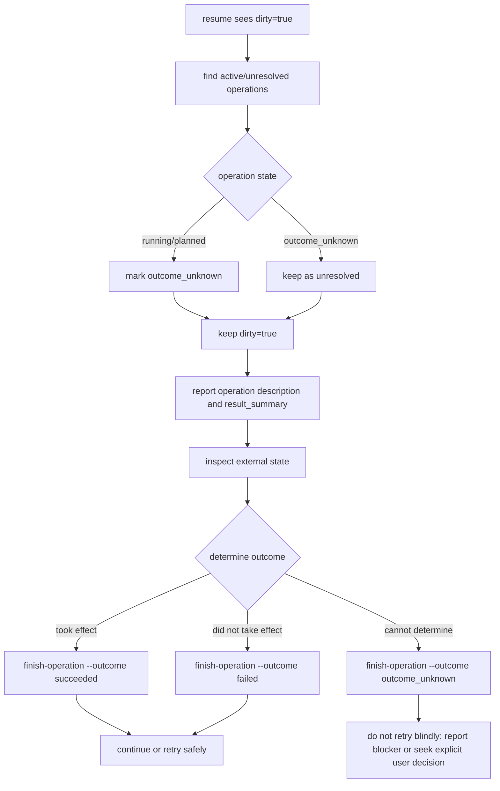

# Recovery Guide

This document defines V1 recovery behavior.  It is intentionally simple and
file-oriented; there is no event-sourcing rebuild engine, database, daemon, or
distributed coordination.

## 1. What a fresh Agent must read

For a selected task, read in this order:

```text
tasks/<task-id>/TASK.md
tasks/<task-id>/STATE.json
tasks/<task-id>/CHECKPOINT.md
```

The fresh Agent must be able to state:

- objective
- requirements
- constraints
- success criteria
- completed steps
- current step
- confirmed facts
- decisions
- side effects already performed
- unresolved operations
- blockers
- next actions

`EVENTS.jsonl` is optional during normal recovery.  Read it only for audit,
dirty recovery, or when `STATE.json` is damaged.

## 2. Normal recovery algorithm

```text
1. Run init.py.
2. Inspect active_task on the session.
3. If no active_task and exactly one resumable task, choose it.
4. If multiple resumable tasks exist, present them; do not randomly choose.
5. If the user names a task, choose that task.
6. Run resume.py with --task (or --latest).
7. Read TASK.md.
8. Read STATE.json.
9. Read CHECKPOINT.md.
10. Check status, current_step, next_actions, steps, dirty, active_operation.
11. Confirm there are no unresolved operations.
12. Revalidate external state where task correctness depends on it.
13. Continue with the first next action.
```

CLI:

See `references/cli.md` for exact command syntax.

Normal recovery requires no event replay.

## 3. Dirty recovery

A task is dirty when `STATE.json.dirty == true` or when an operation is in
`planned`, `running`, or `outcome_unknown`.



The resume script performs the conservative transition:

```text
running/planned -> outcome_unknown
dirty -> true
```

It never transitions an unresolved operation to `succeeded` automatically.

Example:

See `references/cli.md` for exact command syntax.

## 4. `outcome_unknown` handling

`outcome_unknown` means the system cannot prove whether a side effect took
effect.

Rules:

1. Never blindly re-execute the operation.
2. Inspect the external world first:
   - file exists / content matches
   - process is running / stopped
   - package is installed / absent
   - server responds / does not respond
   - database row exists / absent
   - remote API idempotency key accepted / conflict
   - repository state / commit exists
   - generated artifact exists and has expected properties
3. Decide:
   - effect confirmed -> `succeeded`
   - effect definitely did not happen -> `failed`
   - still ambiguous -> keep `outcome_unknown` and surface a blocker
4. Only after resolution may the Agent decide whether a retry is safe.

If a tool supports idempotency or can be made idempotent, prefer that before
retrying.

## 5. Expired lease and takeover

Lease rules:

```text
owner == current session
    -> renew lease

owner != current session and lease still valid
    -> no automatic takeover
    -> report LeaseConflict

owner != current session and lease missing/expired
    -> write TASK_TAKEOVER
    -> set owner_session = current session
    -> renew lease
    -> continue recovery
```

CLI recovery:

See `references/cli.md` for exact command syntax.

Takeover always appends `TASK_TAKEOVER` and updates the session's
`active_task`.

## 6. State corruption recovery

Recovery priority when `STATE.json` is readable:

```text
STATE.json + CHECKPOINT.md + TASK.md
```

When `STATE.json` is corrupt or unreadable:

```text
TASK.md + CHECKPOINT.md + EVENTS.jsonl
```

V1 algorithm:

```text
1. Try to load STATE.json.
2. If invalid JSON or invalid schema:
   a. preserve the damaged file exactly as-is
   b. do not delete or overwrite it
   c. write RECOVERY_REQUIRED.md next to it (unless already present)
   d. append STATE_CORRUPTION_DETECTED to EVENTS.jsonl when possible
   e. read TASK.md for objective/requirements/constraints/success criteria
   f. read CHECKPOINT.md for last position, facts, decisions, side effects
   g. inspect EVENTS.jsonl tail for the most recent lifecycle events
   h. report a clear corruption error with recovery paths
3. If enough information exists:
   a. create a separate recovery task or recovery state file
   b. mark the task blocked or recreate state with a new revision
   c. explain the uncertainty to the user
4. If safe recovery is impossible:
   a. mark task blocked (using a preserved copy)
   b. report the corruption
   c. do not delete original files
```

V1 does not rebuild state automatically from events.  Event log is a hint, not
an automatic authority.

Example command that returns recovery info:

See `references/cli.md` for exact command syntax.

On corruption, stderr includes an error and a JSON `recovery` object containing
paths and event hints, while the damaged `STATE.json` remains untouched.  A
`RECOVERY_REQUIRED.md` sidecar records the blocked/recovery-required condition
and the event tail records `STATE_CORRUPTION_DETECTED`.

## 7. Missing index

`index.json` is not authoritative.  If missing:

```text
init.py / list.py / resume.py
-> scan tasks/*/STATE.json and sessions/*.json
-> rebuild index.json atomically
-> continue
```

Task state still comes from `tasks/<task-id>/STATE.json`.

## 8. Missing CHECKPOINT.md

`CHECKPOINT.md` is a compact generated summary.  If it is missing:

1. Read `TASK.md` and `STATE.json`.
2. Reconstruct the recovery summary from them and `EVENTS.jsonl` tail if needed.
3. Write a new checkpoint after the task state is understood or reconciled.

`resume.py` rewrites `CHECKPOINT.md` from authoritative state after recovery.

## 9. Multiple unfinished tasks

If a new session finds multiple unfinished tasks:

1. Do not randomly bind to one.
2. Output candidate tasks with id, title, status, current step, and updated_at.
3. Use the current user message to select:
   - explicit task id -> use it
   - clear continuation of one candidate -> resume it
   - clear new work -> create a new task
4. If the user is ambiguous, ask.

CLI:

See `references/cli.md` for exact command syntax.

## 10. External state revalidation

Persisted state means "last known state", not "current external truth".

After recovery, revalidate any external dependency that affects correctness:

| Dependency | Minimum revalidation |
|---|---|
| file | exists, size/hash/content expected? |
| Git repo | branch, HEAD, dirty status, commit exists? |
| package install | package/version importable/present? |
| process | running and responsive? |
| server | port/socket/health check? |
| database | row/schema/transaction state? |
| remote API | idempotency key, resource existence? |
| deployment | release currently active? |
| generated artifact | exists and matches expected output? |

Examples:

```text
STATE says "server starting"
-> on resume check whether server is actually running
-> update checkpoint with the verified fact
```

```text
STATE says "package install running"
-> on resume inspect package presence before retry
-> finish operation as succeeded/failed/outcome_unknown
```

## 11. Crash recovery checklist

```text
[ ] init.py completed; session id known
[ ] active/resumable task selected deliberately
[ ] TASK.md read
[ ] STATE.json read
[ ] CHECKPOINT.md read
[ ] dirty flag checked
[ ] active_operation checked
[ ] every unresolved operation inspected externally
[ ] outcome persisted as succeeded/failed/outcome_unknown
[ ] external state revalidated
[ ] current_step and next_actions confirmed
[ ] takeover event written if applicable
[ ] response ends only after state matches progress
```
